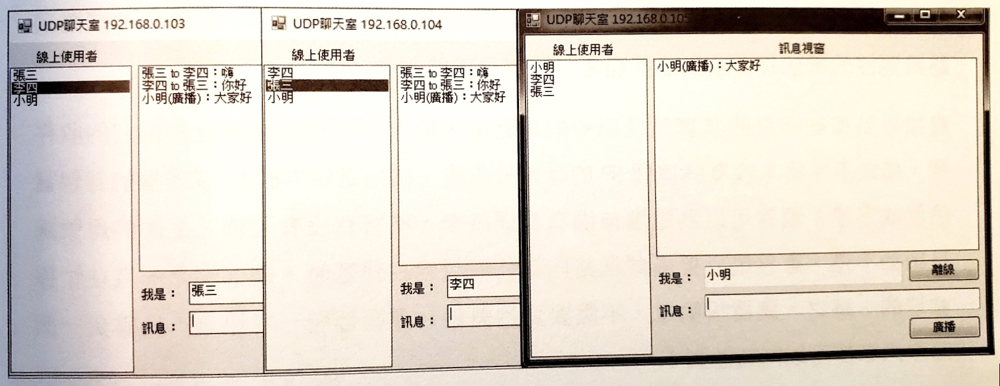

# c-sharp-lab

## UWP Example

## Visual C#網路程式設計－線上遊戲實作

### Chapter 1: UDP 即時通程式

### Chapter 2: UDP 塗鴉牆

### Chapter 3: UDP 聊天室

### Chapter 4: UDP Server - 單一通訊埠的通訊

### Chapter 5: TCP 連線與離線

### Chapter 6: TCP 聊天室

### Chapter 7: 線上五子棋

## Reference

1. https://docs.microsoft.com/zh-tw/visualstudio/get-started/csharp/?view=vs-2019
2. https://www.drmaster.com.tw/Bookinfo.asp?BookID=MP32010
